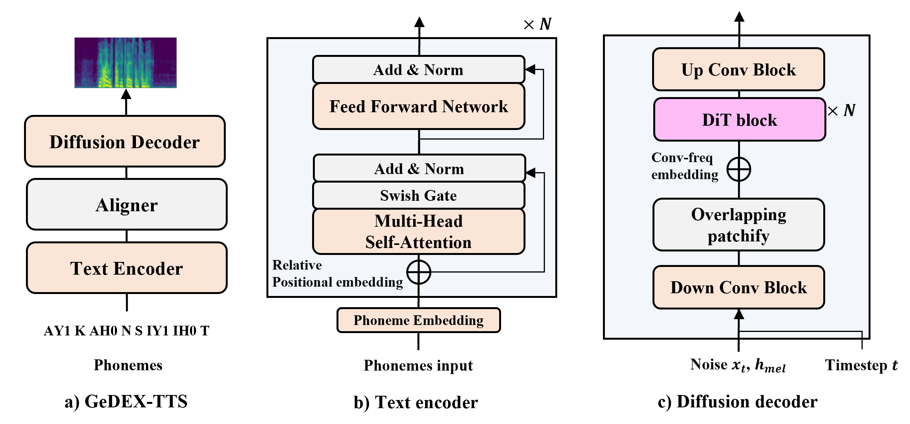

# DEX-TTS: Diffusion-based EXpressive Text-to-Speech with Style Modeling on Time-Variability

This repository is the **official** implementation of *[DEX-TTS: Diffusion-based EXpressive Text-to-Speech with Style Modeling on Time Variability](https://arxiv.org/abs/2406.19135)*. 

In this repository, we provide steps for running *GeDEX-TTS*, general TTS version of DEX-TTS.

If you want to run *DEX-TTS*, move to [DEX-TTS](https://github.com/winddori2002/DEX-TTS/tree/main/DEX-TTS) repository.

🙏 We recommend you visit our [demo site](https://dextts.github.io/demo.github.io/). 🙏

*GeDEX-TTS* is the improved diffusion-based TTS, the general version of DEX-TTS, which does not use reference speech. The overall architecture of *GeDEX-TTS* is as below:

<p align="center">
	
</p>


## Requirements

First install torch based on your environment (We tested on torch version (1.10.1, 1.12.1, 2.1.0)).

```
conda install pytorch==1.10.1 torchvision==0.11.2 torchaudio==0.10.1 cudatoolkit=11.3 -c pytorch -c conda-forge

or

pip install torch==1.10.1+cu111 torchvision==0.11.2+cu111 torchaudio==0.10.1 -f https://download.pytorch.org/whl/cu111/torch_stable.html
```

To install requirements:

```
pip install -r requirements.txt
```

For MAS algorithmm run the code below.

```
cd ./model/monotonic_align; python setup.py build_ext --inplace
```

For pre-trained [HiFi-GAN](https://github.com/jik876/hifi-gan) or [BigVGAN](https://github.com/NVIDIA/BigVGAN) vocoder, download vocoder [weights](https://github.com/winddori2002/DEX-TTS/releases/tag/weights), unzip them, and  place them ```./bigvgan``` or ```hifigan/weights```. 

## Prepare datasets

For general TTS, we use the LJSpeech and VCTK datasets.

- The LJSpeech dataset can be downloaded [here](https://keithito.com/LJ-Speech-Dataset/).

- The VCTK dataset can be downloaded [here](https://datashare.ed.ac.uk/handle/10283/2651).

- We follow the train, valid, and test set split of Grad-TTS for the LJSpeech dataset.

- We use the same set split as DEX-TTS for the VCTK dataset.


## Preprocess

To generate features (mel-spectrograms and pitch), run the following code with the config option (LJSpeech and VCTK):

```
python ./preprocess/preprocess.py --config ./config/{dataset}/preprocess.yaml

Example:
    python ./preprocess/preprocess.py --config ./config/LJSpeech/preprocess.yaml
```

To make file list for training, run the following codes:

```
python ./preprocess/make_file/make_filelist_ljspeech.py
python ./preprocess/make_file/make_filelist_vctk.py
```

The codes yield the meta datalist for training with the format of ```Path|Text|Speaker```.


## Training

To train GeDEX-TTS from the scratch, run the following code.

If you want to change training options such as num_worker, cuda device, and so on, check ```argument.py```.

If you want to edit model or training settings, check ```config/{dataset}/base.yaml```. 

```train
python main.py train --config config/{dataset}/base.yaml

Configurations:
    ├── path
    ├── preprocess
    ├── model
    |     ├── dit
    │     ├── encoder
    │     ├── decoder
    ├── train
    ├── test
```

## Evaluation

You can check Word Error Rate or Cosine Similarity of the synthesized samples by running the code.

If you use ```pa``` option, the text for synthesis is from the dataset.

Or if you don't use ```pa``` option, the text for synthesis is from ```--test_file``` test sentence.

You should match the checkpoint name for ```--test_checkpoint``` option.

```
python main.py test --config config/{dataset}/base.yaml --test_file [test_sentence files] --pa [True/None] --test_checkpoint [checkpoint name]

Example:
    python main.py test --config config/LJSpeech/base.yaml --test_file ./test_sentence/ljspeech_sentence --pa True --test_checkpoint 0
```


## Synthesize

If you want to synthesize samples, run the following codes with pre-trained models.

```
python synthesize.py --input_text "" --weight_path {weight path}
```

## Pre-trained Models

You can find the model [weights](https://github.com/winddori2002/DEX-TTS/releases/tag/weights) trained on the LJSpeech dataset.

## ToDo
- [X] Bigvgan vocoder for multi-speaker TTS
- [X] Pre-trained weight
- [ ] Precondition VE & VP

## Citation

```
@article{park2024dex,
  title={DEX-TTS: Diffusion-based EXpressive Text-to-Speech with Style Modeling on Time Variability},
  author={Park, Hyun Joon and Kim, Jin Sob and Shin, Wooseok and Han, Sung Won},
  journal={arXiv preprint arXiv:2406.19135},
  year={2024}
}
```

## License

> This repository will be released under the MIT license. 

> Thanks to the open source codebases such as [RetNet](https://github.com/microsoft/torchscale/blob/main/torchscale/architecture/retnet.py), [FastSpeech2](https://github.com/ming024/FastSpeech2), [Grad-TTS](https://github.com/huawei-noah/Speech-Backbones/tree/main/Grad-TTS), [DiT](https://github.com/facebookresearch/DiT/tree/main), [MaskDiT](https://github.com/Anima-Lab/MaskDiT), and [EDM](https://github.com/NVlabs/edm). This repository is built on them.

