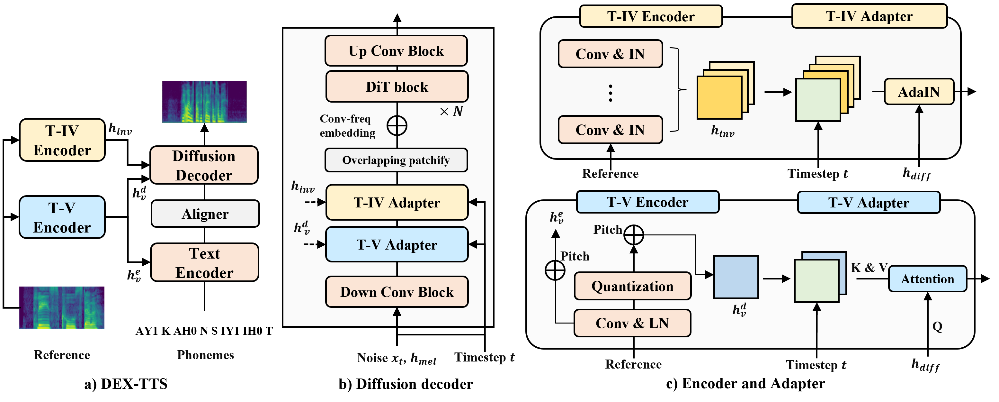

# DEX-TTS: Diffusion-based EXpressive Text-to-Speech with Style Modeling on Time Variability

This repository is the **official** implementation of *[DEX-TTS: Diffusion-based EXpressive Text-to-Speech with Style Modeling on Time Variability](https://arxiv.org/abs/2406.19135)*. 

In this repository, we provide steps for running [DEX-TTS](https://github.com/winddori2002/DEX-TTS/tree/main/DEX-TTS) and [GeDEX-TTS](https://github.com/winddori2002/DEX-TTS/tree/main/GeDEX-TTS). 

🙏 We recommend you visit our [demo site](https://dextts.github.io/demo.github.io/). 🙏

*DEX-TTS* is diffusion-based expressive TTS using reference speech. The overall architecture of *DEX-TTS* is as below:

<p align="center">
	
</p>

*GeDEX-TTS* is the general version of DEX-TTS, which does not use reference speech. The overall architecture of *GeDEX-TTS* is as below:

<p align="center">
	
</p>

## Shortcuts

You can find codes, a demo site, and paper links below.

**[[👉 Demo](https://dextts.github.io/demo.github.io/)]** &nbsp;&nbsp;&nbsp;&nbsp;
**[[📄 Paper](https://arxiv.org/abs/2406.19135)]** &nbsp;&nbsp;&nbsp;&nbsp;
**[[💻 DEX-TTS Code](https://github.com/winddori2002/DEX-TTS/tree/main/DEX-TTS)]** &nbsp;&nbsp;&nbsp;&nbsp;
**[[💻 GeDEX-TTS Code](https://github.com/winddori2002/DEX-TTS/tree/main/GeDEX-TTS)]** &nbsp;&nbsp;&nbsp;&nbsp;

## ToDo
- [X] Bigvgan vocoder for multi-speaker TTS
- [ ] Multi-gpu training codes
- [ ] LibriTTS & Simpe preprocess recipes
- [ ] Pre-trained weight for DEX-TTS
- [X] Pre-trained weight for GeDEX-TTS
- [ ] Precondition VE & VP
- [ ] Evaluation

## Citation

```
@article{park2024dex,
  title={DEX-TTS: Diffusion-based EXpressive Text-to-Speech with Style Modeling on Time Variability},
  author={Park, Hyun Joon and Kim, Jin Sob and Shin, Wooseok and Han, Sung Won},
  journal={arXiv preprint arXiv:2406.19135},
  year={2024}
}
```

## License

> This repository will be released under the MIT license. 

> Thanks to the open source codebases such as [RetNet](https://github.com/microsoft/torchscale/blob/main/torchscale/architecture/retnet.py), [FastSpeech2](https://github.com/ming024/FastSpeech2), [Grad-TTS](https://github.com/huawei-noah/Speech-Backbones/tree/main/Grad-TTS), [DiT](https://github.com/facebookresearch/DiT/tree/main), [MaskDiT](https://github.com/Anima-Lab/MaskDiT), and [EDM](https://github.com/NVlabs/edm). This repository is built on them.
